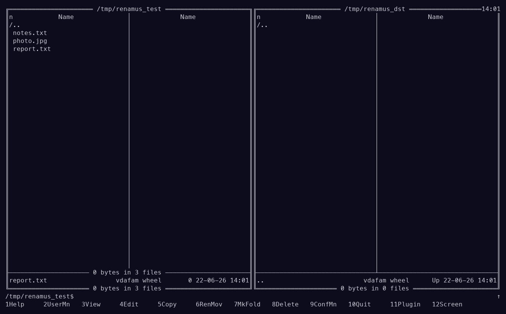

# Renamus — visual group rename for far2l

**Version 0.2.0**

A small [far2l](https://github.com/elfmz/far2l) plugin for renaming many files at
once by editing their names as plain text. Select files on a panel, run the
plugin, edit the names in the built-in editor (one per line), save and close —
every line you changed renames its file.



*Panel → select files → their names open in the editor → edit as plain text →
save & close and they're renamed. Above, `notes.txt` / `photo.jpg` /
`report.txt` all get a `2026_` prefix in one step.*

Inspired by the FAR Manager plugin *VisRen*.

## ⚠️ Disclaimer

This plugin was **100% vibecoded** together with an AI assistant (Claude). It is a
personal tool that I use daily because batch renaming is otherwise painful, shared
in case it's useful to you too.

- **No warranty of any kind.** Provided "as is" (see [LICENSE](LICENSE)).
- **Use at your own risk.** It renames files on disk. Try it on copies / a test
  folder first and make sure you understand the [footguns](#safety--caveats-footguns)
  below.
- **No support or maintenance promised.** Issues/PRs welcome but may go unanswered.

It works for me. 🙂

## Install (prebuilt)

1. **Download** the archive for your platform from the
   [latest release](https://github.com/vdasus/renamus/releases/latest):

   | Platform | Asset |
   |----------|-------|
   | macOS (Intel, x86_64) | `renamus-0.2.0-macos-x86_64.zip` |
   | Linux (glibc, x86_64) | `renamus-0.2.0-linux-x86_64.zip` |

   Built against far2l 2.8 (FARMANAGERVERSION 2.6). The binary must match your
   far2l's OS/architecture — for anything else (ARM, musl, …) build from source
   (below). On macOS the binary is unsigned: if Gatekeeper complains, run
   `xattr -dr com.apple.quarantine renamus`.

2. **Unpack** it. You get a ready-to-copy `renamus/` folder.

3. **Find your far2l `Plugins` directory:**
   - macOS app bundle: `far2l.app/Contents/MacOS/Plugins/`
   - Linux install: `/usr/lib/far2l/Plugins/` (or `<prefix>/lib/far2l/Plugins/`)
   - Per-user (either OS): `~/.config/far2l/Plugins/`

4. **Copy** the folder in:

   ```sh
   # macOS example
   cp -R renamus /Applications/far2l.app/Contents/MacOS/Plugins/

   # Linux example
   cp -R renamus ~/.config/far2l/Plugins/
   ```

   Resulting layout:

   ```
   Plugins/renamus/plug/renamus.far-plug-wide
   Plugins/renamus/plug/RenamusEng.hlf
   ```

5. **Restart far2l** (it scans plugins at startup). If it doesn't appear, make
   sure you are not launching with `-co` / a stale plugin cache.

### Use it

Select files on a panel → **F11 → Renamus** → edit the names in the editor →
**F2** to save → **F10**/**Esc** to close. Changed lines rename their files.

## Build from source

The plugin only needs the far2l **headers** (it resolves host functions at load
time), so point CMake at any far2l source tree:

```
cmake -G Ninja -B build -DFAR2L_SRC=/path/to/far2l
ninja -C build
```

`FAR2L_SRC` is the directory containing `far2l/` and `WinPort/`. The result is a
ready-to-copy folder:

```
build/renamus/plug/renamus.far-plug-wide
build/renamus/plug/RenamusEng.hlf
```

Copy `build/renamus` into your far2l `Plugins/`.

## Safety & caveats (footguns)

No data-loss path: far2l's `MoveFile` refuses to overwrite an existing target, so
a colliding rename simply **fails** and the original file is untouched. Failed
renames are listed by name (with a reason) in a dialog after the run. Still:

1. **Don't reorder lines.** Names map by *position* — line 3 renames the 3rd
   selected file. Sorting/moving lines makes files take each other's names.
2. **Swaps/shifts are single-pass.** `a→b` while `b→c` processes top-down: `a→b`
   fails because `b` still exists, then `b→c` succeeds. No loss, partial result —
   re-run to finish.
3. **Adding/removing lines aborts the whole run** (line count must match the
   selection). Nothing is renamed.
4. **Empty line = skip** that file.
5. **Case-only renames** (`a.txt`→`A.txt`) fail on case-insensitive filesystems
   (default macOS APFS) — the target "already exists".

Set `RENAMUS_DEBUG=/path/to/log` before launching far2l to append a trace
(selection, editor result, per-file `MoveFile` outcome).

## Requirements

[far2l](https://github.com/elfmz/far2l) — the two-panel file manager this plugin
runs in. Get it from the official repository: **https://github.com/elfmz/far2l**

## License

MIT — see [LICENSE](LICENSE).

---

Made for [far2l](https://github.com/elfmz/far2l). Not affiliated with the far2l project.
